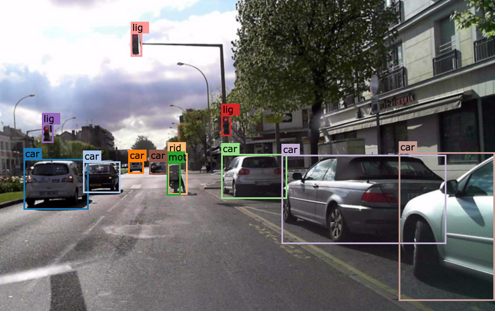
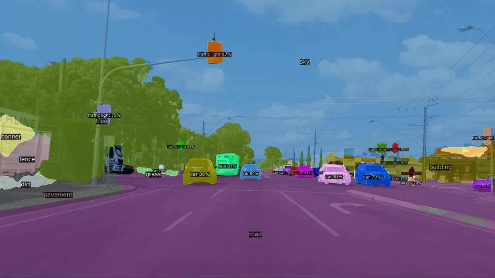
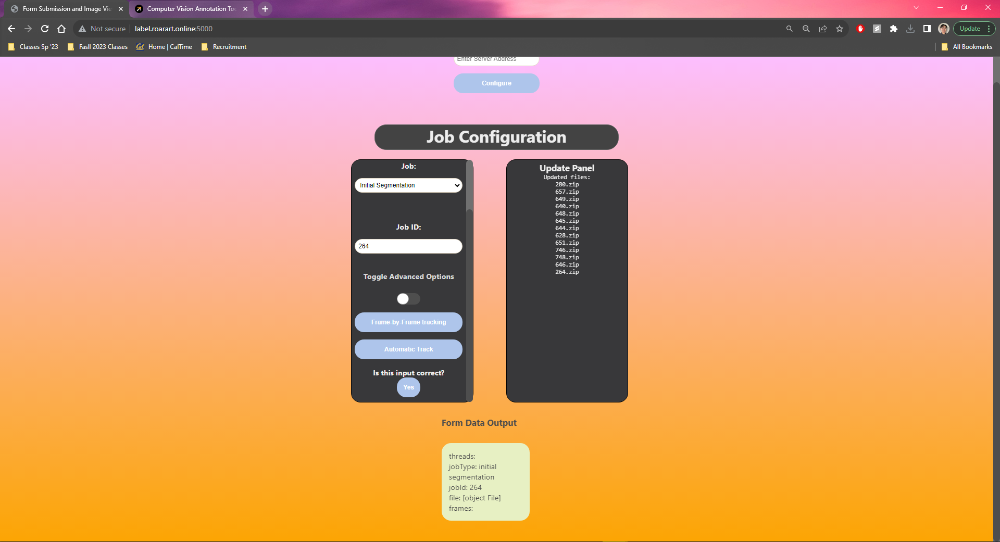
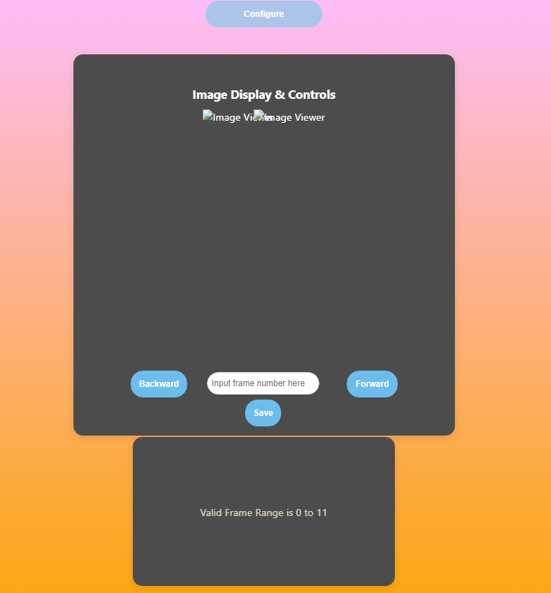
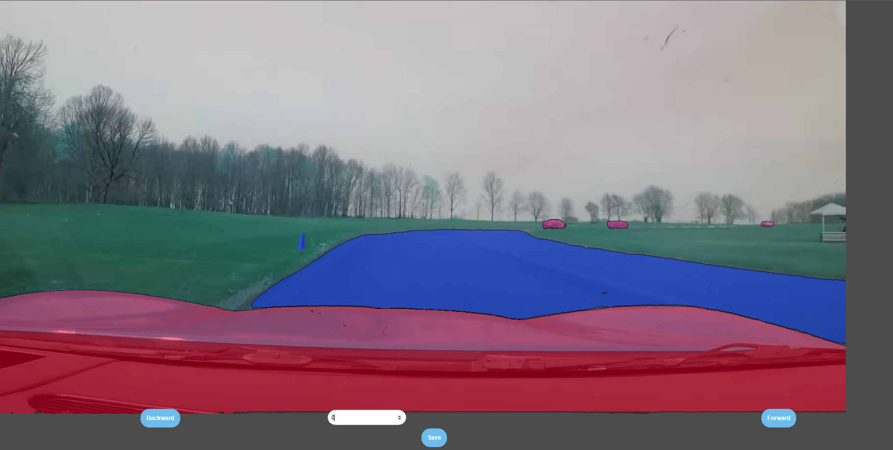

# CVAT Instance Segmentation Tracker

<aside>
☎️ Author: Kevin Chow

</aside>

<aside>
📧 contact: chowmein113@berkeley.edu

</aside>

# Overview

   OpenCV’s Computer Vision Annotation Tool (https://github.com/opencv/cvat) is an annotation tool that has recently been updated to use Facebook Research’s Segment-Anything-Model (https://github.com/facebookresearch/segment-anything) allows for high quality segmentations to be produced on any given image uploaded into CVAT, including frames of videos, but only allows for single frame annotations. In order to produce segmentation masks to label video data, **each frame** would need to be **done by hand**. CVAT only supports bounding box trackers out of the box (no pun intended). Recently there has been a paper and repository published called SAM-Track (https://github.com/z-x-yang/Segment-and-Track-Anything) which can track segmentation masks real-time, which is super fast and accurate, to extend Instance Segmentation from images to videos!

## Problem

   CVAT allows for team labelling by organizing team structures and roles, and assigning jobs and tasks. It also supports labeling with segmentation masks (i.e. can assign a certain type of mask to be a car or a road) which can be used to produce labeled training data for object detection with segmentation masks rather than bounding box methods to predict not just the location and label of an object, but its shape as well ([Object Detection vs Object Segmentation](https://www.linkedin.com/pulse/object-segmentation-vs-detection-which-one-should-you-ritesh-kanjee/)). 

   The problem is that CVAT does not currently support Segmentation Tracking. We want to track segmented objects throughout a video based on an initial segmentation on any given frame from CVAT. SAM-Track also does not support annotation file imports or labeled segmentation masks. 

Instance Segmentation Tracker solves this problem.

### Bounding Box Tracking vs Instance Segmentation Tracking




<!--  -->


# Description

<aside>
📧 The Instance Segmentation Tracker (IST), built off of (https://github.com/z-x-yang/Segment-and-Track-Anything), allows for seamless and efficient Labeled Instance Segmentation Tracking.

</aside>

Without a segmentation tracker, labeling video data with segmentation masks in CVAT would be manually annotated by hand:

## Labeling Segmentations by Hand:

https://github.com/airacingtech/roar-seg-and-track-anything/assets/83838942/87ed37ac-b8cf-4baa-8928-e24879cabb88


## Instance Segmentation Tracker:

https://github.com/airacingtech/roar-seg-and-track-anything/assets/83838942/7431caa6-2c41-4dc6-b89c-4fd6d793c607


# How to Use:

# Installation

```bash
cd /your/desired/parent/directory
git clone git@github.com:chowmein113/roar-seg-and-track-anything.git
cd roar-seg-and-track-anything/
conda env create -f updated_environment.yml
conda activate SAMT
pip install -r requirements.txt
```

Follow requirements and model preparation via original SAMT github if you want SAM and Grounding Dino checkpoints:

[GitHub - z-x-yang/Segment-and-Track-Anything: An open-source project dedicated to tracking and segmenting any objects in videos, either automatically or interactively. The primary algorithms utilized include the Segment Anything Model (SAM) for key-frame segmentation and Associating Objects with Transformers (AOT) for efficient tracking and propagation purposes.](https://github.com/z-x-yang/Segment-and-Track-Anything#bookmark_tabsrequirements)

only need to run:

```bash
bash script/install.sh
bash script/download_ckpt.sh
```

# To run

### Start Conda Environment

```bash
cd "path to repository"
conda activate SAMT

```

## GUI:

```bash
python3 roar_server.py
```

<aside>
💡 If locally hosted, go to https://localhost:5000, use the URL roar_server is hosted on otherwise

</aside>

<aside>
💡 Change global variable, UPLOADS_FOLDER in roar_server.py to path where downloaded annotation files are desired to be placed

</aside>

### Starter Page


There are a few options here:

1. **Server Configuration**
    1. If hosting server locally, or a different URL than the URL provided, use server configuration to tell the website where the server is located.
2. **Job Configuration**
    1. This is the main panel to track instance segmentation frames
    2. **Job**
        1. **Initial Segmentation**
            1. first tracking job done which should contain images as well as the annotations file of desired video
        2. **Re-segmentation**
            1. Any annotation fixes sent back to tracker with only new annotation file
            2. if this option is selected, a text box asking for relabeled frames in Comma-Separated Value format will appear
    3. **Update Panel**
        1. If using CVAT, will read off an update panel for recently exported annotations
    4. **Threads**
        1. If multiple different frames are annotated, other than the first frame, can parallel process the job and user can specify amount of max thread workers
        2. Defaults to 1 if no input
    5. **Job**
        1. The desired Job ID to track
    6. **TRACKING**
        1. **Frame-by-Frame Tracking**
            1. Will open panel for tracking through frames by manual input of user
        2. **Automatic Track**
            1. Will track through entire video automatically and export annotation file for user to download under **Form Data Output**
    7. Selecting either option will bring this metadata option up to verify
        1. Simply click yes and watch the magic happen
            
            
            

### Frame-by-Frame Tracking:

- A visual version of the tracker, can see what the tracker is tracking at each frame and quickly export to CVAT to re-segment once object tracking diverges
- PROS:
    - can see each frame the tracker is tracking
    - can quickly export annotations once tracking diverges unlike automatic tracking which will track all frames given even if tracking diverges
        - automatic tracking will make annotations that diverge once tracking diverges, usually past a key frame
- CONS
    - Automatic tracking can take advantage of parallel processing if given multiple key frame annotations, Frame-by-Frame is linear and will generate new frames only if specified
- **HOW TO USE:**
    - once frame-by-frame tracking is clicked, will show a valid frame range user can enter.
    
    
    
    
    
    
    - Type in a given frame in the valid range and press enter
    - can use forward and backward to iterate current frame by +1/-1 respectively
    
    
    
    
    ### Demonstration:
    https://github.com/airacingtech/roar-seg-and-track-anything/assets/83838942/d4078540-2677-41d6-9b75-ef6466563bfc


    

## Command Line Interface

To use CLI, run:

```python
python3 roar_main.py
```

<aside>
💡 Place file in specified DOWNLOADS_PATH global variable in roar_main.py, change this depending on your set up

</aside>

follow instructions displayed on screen:

### Key Terms:

- Re-Segmentation
    - If this is the first segmentation for a given annotation task, select no
    - if yes is selected,
        - you will be asked to specify which frames have been reannotated in CSV format
- Job ID
    - The number of the job and zip file, zip file should be named, {JOB ID}.zip
- Reuse Output Annotation
    - if you want to reuse the annotation output from a previous tracking run for this specific job, click yes
    - useful if you want to re-track with the frame right before tracking diverges and you don’t want to reannotate
- multithreading
    - If given multiple annotated key frames, can use multithreading to parallel process tracking on Cuda device
- Delete zip
    - if you want an automatic clean up and get rid of the zip file you give to the tracker, use this option
 
### Credits
* SAM-Track - [https://github.com/z-x-yang/Segment-and-Track-Anything](https://github.com/z-x-yang/Segment-and-Track-Anything
