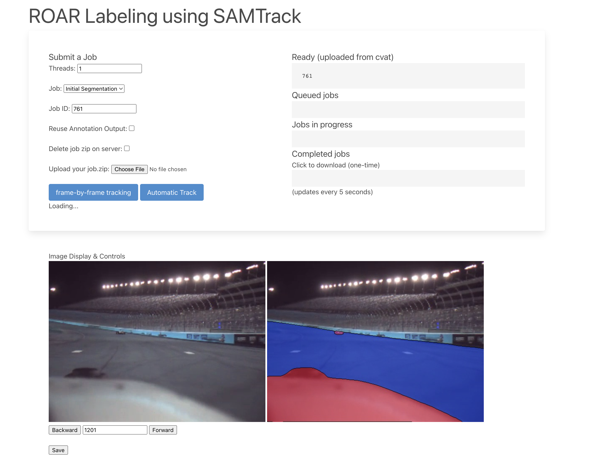

# CVAT Instance Segmentation Tracker

Jump to [running the server](#running-the-server)

## Overview

   OpenCV’s Computer Vision Annotation Tool (https://github.com/opencv/cvat) is an annotation tool that has recently been updated to use Facebook Research’s Segment-Anything-Model (https://github.com/facebookresearch/segment-anything) allows for high quality segmentations to be produced on any given image uploaded into CVAT, including frames of videos, but only allows for single frame annotations. In order to produce segmentation masks to label video data, **each frame** would need to be **done by hand**. CVAT only supports bounding box trackers out of the box (no pun intended). Recently there has been a paper and repository published called SAM-Track (https://github.com/z-x-yang/Segment-and-Track-Anything) which can track segmentation masks real-time, which is super fast and accurate, to extend Instance Segmentation from images to videos!

### Problem

   CVAT allows for team labelling by organizing team structures and roles, and assigning jobs and tasks. It also supports labeling with segmentation masks (i.e. can assign a certain type of mask to be a car or a road) which can be used to produce labeled training data for object detection with segmentation masks rather than bounding box methods to predict not just the location and label of an object, but its shape as well ([Object Detection vs Object Segmentation](https://www.linkedin.com/pulse/object-segmentation-vs-detection-which-one-should-you-ritesh-kanjee/)). 

   The problem is that CVAT does not currently support Segmentation Tracking. We want to track segmented objects throughout a video based on an initial segmentation on any given frame from CVAT. SAM-Track also does not support annotation file imports or labeled segmentation masks. 

Instance Segmentation Tracker solves this problem.

### Bounding Box Tracking vs Instance Segmentation Tracking


<aside>
📧 The Instance Segmentation Tracker (IST), built off of (https://github.com/z-x-yang/Segment-and-Track-Anything), allows for seamless and efficient Labeled Instance Segmentation Tracking.
</aside>

Without a [segmentation tracker](https://github.com/airacingtech/roar-seg-and-track-anything/assets/83838942/7431caa6-2c41-4dc6-b89c-4fd6d793c607)
, labeling video data with segmentation masks in CVAT would be
[manually annotated by hand](https://github.com/airacingtech/roar-seg-and-track-anything/assets/83838942/87ed37ac-b8cf-4baa-8928-e24879cabb88)


## Installation

```bash
cd /your/desired/parent/directory
git clone git@github.com:chowmein113/roar-seg-and-track-anything.git
cd roar-seg-and-track-anything/
conda env create -f updated_environment.yml
conda activate SAMT
pip install -r requirements.txt
```

Follow requirements and model preparation via original SAMT github if you want SAM and Grounding Dino checkpoints:

[GitHub - z-x-yang/Segment-and-Track-Anything: An open-source project dedicated to tracking and segmenting any objects in videos, either automatically or interactively. The primary algorithms utilized include the Segment Anything Model (SAM) for key-frame segmentation and Associating Objects with Transformers (AOT) for efficient tracking and propagation purposes.](https://github.com/z-x-yang/Segment-and-Track-Anything#bookmark_tabsrequirements)

only need to run:

```bash
bash script/install.sh
bash script/download_ckpt.sh
```

## Running the server

Make sure to configure your `.env` (see `example.env`).

Start workers in another terminal(s):
```bash
celery -A roar_server.celery worker --loglevel=info -P eventlet -E -n worker1
celery -A roar_server.celery worker --loglevel=info -P eventlet -E -n worker2
...
```

In the root directory:
```bash
conda activate SAMT
python3 roar_server.py
```

## Using the GUI


- **Job**
  - **Initial Segmentation** will take the single annotated frame (uploaded from cvat) and will track them through the rest of the frames.
  - **Re-segmentation** is for annotation fixes; select individual frames by entering comma separated numbers
- **Job ID** should match one of the job ids in the `Ready` box
- **Threads** determines max thread workers; useful if multiple different frames are annotated (not initial segmentation)
- **Reuse Annotation Output**
    - if you want to reuse the annotation output from a previous tracking run for this specific job, click yes
    - useful if you want to re-track with the frame right before tracking diverges and you don’t want to reannotate
- **Automatic Track** will submit the job
- **Frame-by-Frame Tracking** will open panel for tracking through frames by manual input of user. See more details of usage below.


### Manual tracking (frame-by-frame)
A visual version of the tracker, can see what the tracker is tracking at each frame and quickly export to CVAT to re-segment once object tracking diverges.

- PROS:
    - can see each frame the tracker is tracking
    - can quickly export annotations once tracking diverges unlike automatic tracking which will track all frames given even if tracking diverges
        - automatic tracking will make annotations that diverge once tracking diverges, usually past a key frame
- CONS
    - Automatic tracking can take advantage of parallel processing if given multiple key frame annotations, Frame-by-Frame is linear and will generate new frames only if specified
- **HOW TO USE:**
   - 
    - Type in a given frame in the valid range and press enter
    - can use forward and backward to iterate current frame by +1/-1 respectively
    - Demonstration https://github.com/airacingtech/roar-seg-and-track-anything/assets/83838942/d4078540-2677-41d6-9b75-ef6466563bfc


## Command Line Interface

```python
python roar_main.py
```

 
### Credits
* SAM-Track - [https://github.com/z-x-yang/Segment-and-Track-Anything](https://github.com/z-x-yang/Segment-and-Track-Anything


<aside>
contact: Kevin Chow chowmein113@berkeley.edu
</aside>